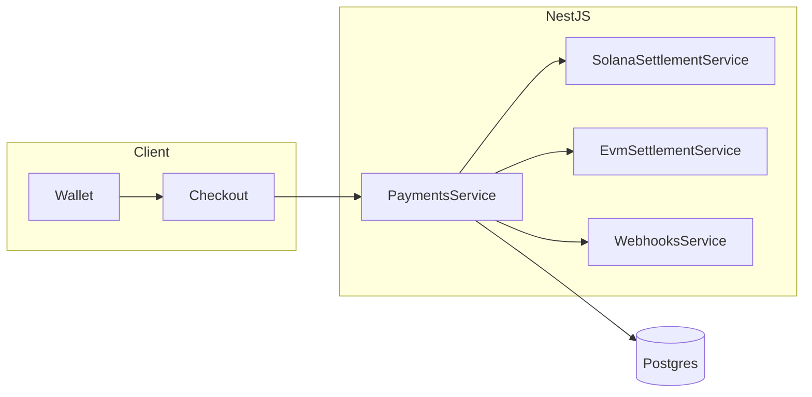

# K-INTENT

K-INTENT is a non-custodial, intent-based payment gateway. The backend records **payment intents** and **verifies** what happened on-chain (Solana today, optional EVM on Sepolia). Merchants receive funds at a configured **treasury** address; the server never holds user keys.

## What the project does

- **Checkout:** Create an intent, pay (native SOL or allowlisted SPL such as devnet USDC), then verify.
- **Dashboard:** Volume by asset class, transaction feed, CSV export.
- **Webhooks:** Optional HMAC-signed `POST` to a merchant URL on `SUCCESS` / `FAILED` (see [backend/docs/WEBHOOKS.md](backend/docs/WEBHOOKS.md)).

## Threat model (what we verify)

| Trust boundary | Behavior |
|----------------|----------|
| Client amount | **Not trusted.** Settlement is validated against chain state and the intent row. |
| Solana native SOL | **Treasury inbound** lamports must increase by at least the intent amount; `TREASURY_PUBLIC_KEY` must match the merchant treasury used at intent creation. |
| Solana SPL | **Treasury** token account (owner = treasury wallet) must gain at least the expected raw amount for the allowlisted mint; decimals come from `MerchantAssetAllowlist`. |
| EVM (Sepolia) | `EVM_RPC_URL` + `EVM_TREASURY_ADDRESS`; native ETH checks `tx.to` and `value`; ERC-20 checks `Transfer` logs to the treasury for allowlisted contracts. |
| Replay | Unique `signature` on success; idempotent verify for the same `(intentId, signature)`. |

**Not covered in this repo:** bridge aggregation, compliance/KYC, MEV guarantees, or automatic webhook retries (see webhooks doc).

## API contract

OpenAPI description: [backend/openapi.yaml](backend/openapi.yaml).

## Local run

1. **Database:** Apply schema ([backend/prisma/supabase-manual-ddl.sql](backend/prisma/supabase-manual-ddl.sql) in Supabase SQL editor, or `prisma db push` against Postgres) and set `DATABASE_URL` in `backend/.env`.
2. **Seed allowlist (optional):** `cd backend && npx prisma generate && npm run prisma:seed`
3. **Backend env:** See [backend/.env.example](backend/.env.example) — at minimum `DATABASE_URL`, `TREASURY_PUBLIC_KEY` (must match `NEXT_PUBLIC_MERCHANT_WALLET` on the frontend), `RPC_URL`.
4. **Frontend env:** `frontend/.env.local` — `NEXT_PUBLIC_API_URL`, `NEXT_PUBLIC_MERCHANT_WALLET` (default recipient in checkout UI), `NEXT_PUBLIC_MERCHANT_ID`; if the backend sets `API_KEY`, set `NEXT_PUBLIC_API_KEY` to match.

**Pay any address:** Checkout includes a **recipient** field; intents store that treasury on-chain verification uses it. **`TREASURY_PUBLIC_KEY`** is only required when the client **omits** `treasuryAddress` on create intent.

**Per-recipient dashboard:** Open `/dashboard?recipient=<solana_address>` (or `0x…` for EVM) to filter metrics and the feed; leave empty to see all intents.
5. Run backend: `cd backend && npm install && npm run start:dev`
6. Run frontend: `cd frontend && npm install && npm run dev`

Landing: `http://localhost:3001/` · Dashboard: `http://localhost:3001/dashboard`

## Demo recording checklist

Use this when capturing a short portfolio video (2–3 minutes):

1. Show `TREASURY_PUBLIC_KEY` / `NEXT_PUBLIC_MERCHANT_WALLET` alignment (same treasury).
2. Create a **SOL** intent, pay in Phantom (or Solflare), show success and Solscan link.
3. **Optional:** Switch to **USDC**, show devnet USDC in wallet (or explain faucet), complete flow.
4. Open **Dashboard** and show metrics + row in the feed.
5. (Optional) Trigger a webhook using a test URL (e.g. webhook.site) and show `X-K-Intent-Signature`.

## Architecture (high level)

## Repository layout

- `backend/` — NestJS, Prisma, Solana + EVM verifiers, webhooks.
- `frontend/` — Next.js 14, Solana Wallet Adapter, checkout + dashboard.
