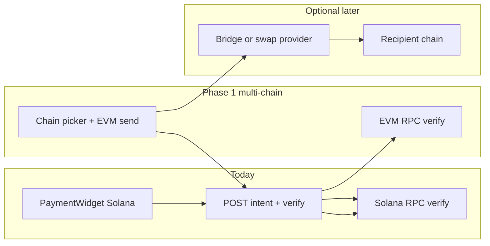

# Kira product plan

This document combines the **recipient / dashboard** work (baseline), **cross-chain** checkout, optional **protocols**, and **Privy** integration.

---

## Part 1 — Pay any address + per-recipient dashboard

### Goal

- **Checkout:** Let the payer specify (or confirm) a **recipient address** per payment, not only a single treasury from env.
- **Dashboard:** Show payments **for that recipient** (or **that operator**), not one global stream — requires a clear rule for identity.

### Current behavior (historical baseline)

- Recipient was effectively fixed: **`TREASURY_PUBLIC_KEY`** / **`NEXT_PUBLIC_MERCHANT_WALLET`** aligned.
- **`PaymentIntent`** stores **`treasuryAddress`** per row; verification uses that field for settlement checks.

### Feasibility

1. **Pay any address** — Accept **`treasuryAddress` (or `recipient`)** from the client at **create intent** time; verify on-chain that funds reached **that** address. Env default when omitted.
2. **Dashboard “for that person”** — Options:
   - **Option A — Recipient-centric (no login):** e.g. `/dashboard?recipient=<address>`, API filters `treasuryAddress`.
   - **Option B — Operator accounts:** Sign in, bind account → recipient(s) or `merchantId`.
   - **Option C — Hybrid:** Demo uses A; production adds B.

### Product rules

- **Create intent:** `amount`, `chainId` / `assetKind` / `mint`, plus **`treasuryAddress`**. Server validates format; env can default recipient.
- **Verification:** Compare chain settlement to **`intent.treasuryAddress`** (stored on intent).
- **Abuse:** Rate limits on verify; optional stricter create-intent limits for arbitrary recipients.

### Backend (high level)

| Area | Change |
|------|--------|
| **DTO** | `CreatePaymentIntentDto`: optional `treasuryAddress`; if absent, server default from env. |
| **`createIntent`** | `treasuryAddress` = client or env default. |
| **API** | `GET /payments?recipient=` and `GET /payments/metrics?recipient=` for dashboard scoping. |

### Frontend (high level)

- **Checkout:** Recipient field; pre-fill from env default.
- **Dashboard:** `recipient` from query or auth; pass to API.

### Security / UX

- **Amount and recipient** — Enforced by on-chain verification vs stored intent.
- **Wrong address** — Clear **“You are paying this address”** confirmation.
- **Privacy** — Public per-recipient URLs expose stats; add auth if needed.

### Implementation status (done)

- Checkout **recipient** field + `treasuryAddress` on `POST /payments/intent`; server defaults to `TREASURY_PUBLIC_KEY` / `EVM_TREASURY_ADDRESS` when omitted.
- `GET /payments?recipient=` and `GET /payments/metrics?recipient=` filter by normalized treasury.
- Dashboard **Recipient filter** + URL `?recipient=`; Overview and Payments pages wired.

---

## Part 2 — Cross-chain checkout (align frontend with backend)

### Where things stand

- **Backend** (`backend/src/payments/payments.service.ts`, `backend/src/solana/solana-settlement.service.ts`, `backend/src/evm/evm-settlement.service.ts`): **Payment intents** on **Solana** (native + SPL) and **EVM** (native + ERC-20 with allowlist). Verification is **per-chain** (no bridging).
- **Frontend** (`frontend/src/components/PaymentWidget.tsx`, `frontend/src/components/providers/WalletProvider.tsx`): **Solana wallet-adapter only** — no EVM send path yet.

**Meaning of “cross-chain”:**

1. **Multi-chain (do this first):** User picks **chain + asset**, pays **on that chain** to `treasuryAddress`; backend verifies on the same chain (already implemented server-side).
2. **Bridge / swap (later):** User pays on **chain A**, treasury receives on **chain B** (aggregators, bridges — larger scope).

### Plan A — Multi-chain UI

1. **Chain and asset selection** — Mirror backend: `chainId`, `assetKind`, optional `mintAddress`, `treasuryAddress` (`backend/src/payments/dto/create-payment-intent.dto.ts`).
2. **EVM payment path** — Add **wagmi + viem** (or ethers) with `NEXT_PUBLIC_*` RPC aligned to `EVM_RPC_URL`. After `POST /payments/intent`, send native ETH or ERC-20 to `treasuryAddress`, then `POST /payments/verify` with **tx hash** (confirm `VerifyPaymentDto` / service naming).
3. **Shared UX** — One widget: **Solana** vs **EVM** tabs/steps; reuse recipient and amount.
4. **Config and safety** — Document frontend vs intent **network mismatch**; surface allowlist errors for SPL/ERC-20; client-side treasury validation (EVM checksum, Solana base58) — patterns in `backend/src/payments/treasury-address.util.ts`.
5. **Dashboard** — `getPaymentMetrics` already splits SOL / SPL / EVM native; adjust labels on mainnet (gas token vs “ETH”).

**Outcome:** One API, multiple chains, non-custodial.

---

## Part 3 — Protocols to add (optional, phased)

| Direction | Examples | Why |
|-----------|----------|-----|
| **Wallet connectivity** | [WalletConnect](https://walletconnect.com/), [Privy](https://privy.io/), Coinbase Smart Wallet | Coverage, mobile, embedded UX |
| **Auth + API security** | SIWE, JWT from Privy, API keys (`backend/src/common/guards/api-key.guard.ts`) | Dashboard / merchant APIs tied to identity |
| **Chain ID standards** | [CAIP-2](https://github.com/ChainAgnostic/CAIPs/blob/master/CAIPs/caip-2.md) | Interop (`eip155:` + Solana-style ids already used) |
| **HTTP payment rails** | [x402](https://www.x402.org/) | Pay-per-request on top of intents |
| **Liquidity / swaps** | LI.FI, Socket, 1inch | Pay in a different token; same or different chain |
| **Bridging** | LayerZero, Wormhole | Settlement chain ≠ payer chain |
| **Price / fiat** | Chainlink, Stripe off-ramp | Fiat display, compliance |

**Suggested order:** Multi-chain native UI → Privy or WalletConnect → LI.FI/Socket if “wrong token” → bridges only if treasury must be on another chain.

---

## Part 4 — Privy integration

**Goals:** Email/social login, **embedded wallets**, **linked Solana + EVM** addresses, optional **server-verified sessions** for dashboard.

### C1 — Decisions

- **Replace vs complement** `@solana/wallet-adapter`: e.g. Privy primary + external connectors, or keep wallet-adapter until unified.
- **Chains** in Privy dashboard: match supported `chainId`s and RPCs.
- **Server:** Verify Privy access tokens for protected routes vs client-only.

### C2 — Frontend

- `@privy-io/react-auth` (+ Solana/EVM per [Privy multi-chain docs](https://docs.privy.io)).
- Wrap app (`frontend/src/app/layout.tsx`) with `PrivyProvider` + `NEXT_PUBLIC_PRIVY_APP_ID`.
- **PaymentWidget:** Solana signer / EVM provider from Privy hooks instead of or alongside `useWallet`.
- **Linking:** One user, embedded + connected Phantom/MetaMask as needed.

### C3 — Backend (optional)

- Privy token verification middleware (Node SDK or JWKS) for user-scoped routes (e.g. `GET /merchants/me/payments`).
- Map Privy user id → `Merchant` or new `User` model.

### C4 — Security / ops

- App **secret** server-only; never in client bundle.
- **CORS / redirect URLs** in Privy dashboard match Next.js deployment URLs.

**Outcome:** Single login, multi-chain signing, foundation for authenticated dashboards.

---

## Part 5 — Implementation order and risks

### Order

1. **EVM checkout** in the widget (unlocks multi-chain with existing API).
2. **Privy** + signing paths for Solana + EVM (or parallel wallet-adapter).
3. **Optional:** Privy auth on Nest for dashboard.
4. **Later:** LI.FI / bridges only if product needs “any token” or “settle elsewhere.”

### Risks

- **Bridging and swaps** — MEV, stuck funds, support load; defer until native multi-chain is stable.
- **Privy** — Vendor lock-in and cost; keep wallet-adapter fallback during migration if useful.

---

## Roadmap checklist

- [ ] EVM wallet + send path (wagmi/viem), env aligned with backend; verify with tx hash
- [ ] Unify PaymentWidget for Solana vs EVM; allowlist errors and chain selection
- [ ] PrivyProvider; map Privy Solana/EVM signers; choose replace vs parallel wallet-adapter
- [ ] Optional: verify Privy tokens on Nest; user ↔ merchant mapping
- [ ] Evaluate WalletConnect, LI.FI/Socket, bridges after native multi-chain ships
